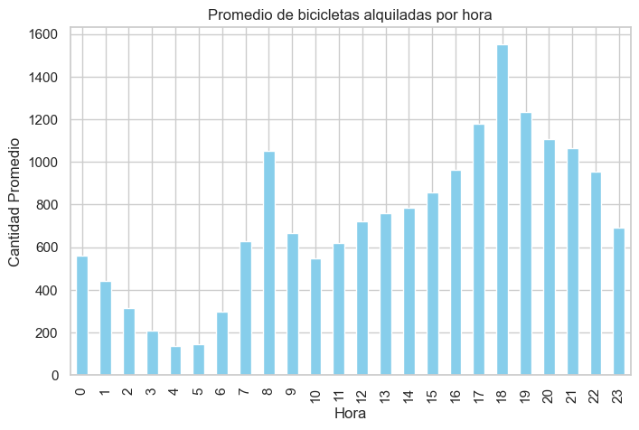
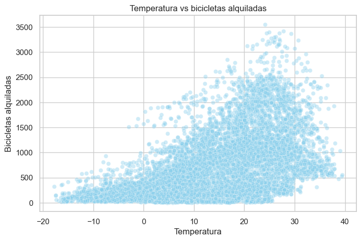

# Análisis de Demanda de Bicicletas

Proyecto de análisis de datos enfocado en explorar los factores que influyen en la demanda de bicicletas alquiladas.  
A partir de variables climáticas, temporales y operativas, se estudian patrones de uso, comportamiento de la demanda y relaciones entre las distintas características del dataset.

## Objetivo

El objetivo de este proyecto es analizar qué variables tienen mayor relación con la cantidad de bicicletas alquiladas y detectar patrones útiles en la demanda.

A lo largo del análisis se trabajó con:
- limpieza y preparación de datos
- transformación de variables
- análisis exploratorio
- visualización de datos
- interpretación de hallazgos

## Dataset

El dataset contiene información sobre el alquiler de bicicletas junto con variables como:

- fecha y hora
- temperatura
- humedad
- velocidad del viento
- visibilidad
- radiación solar
- lluvia
- nieve
- estación del año
- feriados
- estado de funcionamiento del servicio

La variable principal analizada es la cantidad de bicicletas alquiladas.

## Herramientas utilizadas

- Python
- pandas
- numpy
- matplotlib
- seaborn
- Jupyter Notebook

## Proceso de trabajo

El proyecto fue desarrollado siguiendo estas etapas:

1. carga y exploración inicial del dataset  
2. revisión de estructura, tipos de datos y valores faltantes  
3. renombrado y preparación de variables  
4. conversión de fechas y creación de variables derivadas  
5. análisis exploratorio univariado y bivariado  
6. visualización de patrones y relaciones  
7. redacción de conclusiones

## Variables derivadas

Como parte de la preparación de los datos, se generaron variables temporales para enriquecer el análisis, entre ellas:

- mes
- día de la semana
- indicador de fin de semana

Estas variables permitieron observar con mayor claridad cómo cambia la demanda según el contexto temporal.

## Principales hallazgos

Entre los resultados más relevantes del análisis se destacan los siguientes:

- la demanda de bicicletas cambia de forma marcada según la hora del día
- 


- la temperatura muestra una relación positiva con la cantidad de alquileres
- 


- la lluvia y la nieve tienden a reducir la demanda
- existen diferencias de uso entre estaciones del año
- los patrones temporales ayudan a entender mejor el comportamiento de los usuarios

## Estructura del proyecto

```text
bike-demand-analysis/
│
├── data/
│
├── notebooks/
│   └── bike_demand_analysis.ipynb
│
├── images/
│
├── README.md
├── requirements.txt
└── .gitignore
